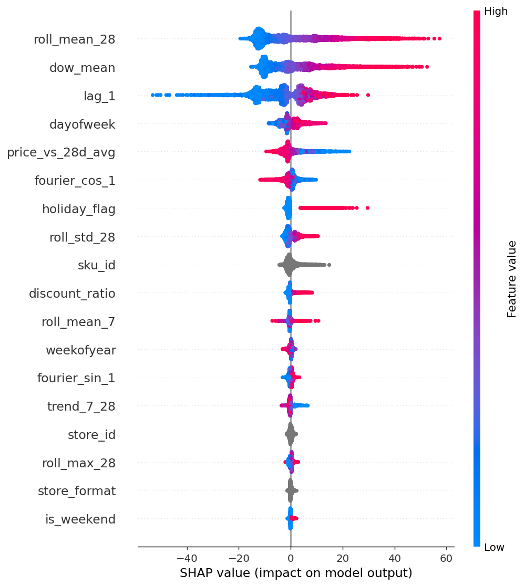

# AI-Powered Demand Forecasting & Inventory Optimization Platform

An end-to-end MLOps system that forecasts retail demand probabilistically and converts those forecasts into inventory decisions — safety stock, reorder points, and order quantities — with experiment tracking, explainability, drift monitoring, and CI/CD.

The forecast is not the deliverable. The order recommendation is.



*Verified project artifact: SHAP summary from the recorded forecasting run.*

```
data → features → quantile model → recursive forecast → inventory policy → order decision
                       ↓                    ↓                   ↓
                    MLflow               SHAP              drift monitor → retrain trigger
```

---

## Results

All numbers below come from an actual run on a 28-day hold-out window (200 store × SKU series, 219,200 rows over 3 years). Reproduce with `make pipeline`.

### Forecast accuracy

| Model | WAPE | MAE | RMSE | MASE | Bias |
|---|---|---|---|---|---|
| Seasonal naive (lag-7) | 0.5041 | 19.56 | 31.27 | 0.411 | −0.093 |
| Moving average (28d) | 0.4216 | 16.36 | 26.27 | 0.344 | +0.030 |
| LightGBM — one-step | 0.3542 | 13.75 | 22.70 | 0.289 | −0.082 |
| **LightGBM — recursive 28d** | **0.3682** | **14.29** | **23.57** | **0.301** | **−0.068** |

**27% WAPE reduction vs seasonal naive**, measured honestly (see *Recursive evaluation* below).

### Quantile calibration

| Quantile | Nominal | Empirical coverage | Pinball loss |
|---|---|---|---|
| P50 | 0.50 | 0.5054 | 7.14 |
| P90 | 0.90 | 0.8861 | 3.49 |

Calibration matters more than point accuracy here: safety stock is derived directly from the P90, so a miscalibrated quantile silently mis-sizes every order.

### Business impact

Both policies swept across identical service-level targets, replayed against the same actual demand:

| Target fill rate | Naive inventory | ML inventory | Reduction |
|---|---|---|---|
| 90% | 128,359 | 122,438 | **4.61%** |
| 93% | 145,033 | 137,012 | **5.53%** |
| 95% | 160,510 | 151,421 | **5.66%** |

**~5.3% average working-capital reduction at matched fill rate.** The ML efficient frontier dominates the naive one across the entire sweep.

---

## Four decisions that shaped this project

### 1. Recursive evaluation, not one-step

Most forecasting projects report a one-step-ahead score: the model sees yesterday's actual sales when predicting 28 days out. In production it does not — actuals arrive days-to-weeks late, and you must forecast the whole horizon to place a purchase order.

Here the model rolls forward day by day, feeding its own predictions back as pseudo-observations and rebuilding lag features at each step. The honest number (0.3682) sits just behind the optimistic one (0.3542), and **the same `recursive_forecast()` function serves the API** — so there is no train/serve skew.

### 2. The first business result was wrong, and finding out why was the point

The initial policy comparison said the ML model was **14% worse** than the naive baseline. Two real bugs were underneath:

- **Unmatched service levels.** Comparing two policies at their own settings measures nothing except which one holds more stock — you can move the result anywhere by turning one knob. Fixed by sweeping both policies across identical service-level targets and comparing the resulting efficient frontiers.
- **Safety stock sized on the wrong variance.** It was computed from the *variance of the forecast* rather than *forecast error*. A flat moving-average forecast has zero variance, so the naive policy was receiving zero safety stock while being the least reliable of the two. Fixed by sourcing σ from realised demand volatility.

After the fix, the ML frontier dominates everywhere.

### 3. Stockouts mean your history is censored

`units_sold` is not demand — it is `min(demand, availability)`. The data generator simulates stockout censoring explicitly, because a model trained on censored sales learns to under-forecast exactly the SKUs that stock out most, which then reinforces the stockout. `true_demand` is retained for diagnostics and never fed to the model.

### 4. A monitor that never fires is indistinguishable from a broken one

The drift module is validated against a control. Two scenarios run every time:

| Scenario | Features drifted | Prediction PSI | Retrain triggered |
|---|---|---|---|
| Natural (last 28d vs prior 90d) | 0 / 15 | 0.0295 | No |
| Injected supply shock | 7 / 15 | 0.5883 | **Yes** |

PSI bin edges are frozen from the reference window — recomputing them on current data is a common bug that hides the drift you are looking for.

One thing this surfaced: at 200k rows the KS test flags nearly every feature as "significant" at p < 0.001, including features whose PSI is 0.016. **PSI is an effect size; KS is a significance test.** The retrain trigger keys on PSI and realised WAPE, not on p-values.

---

## Architecture

```
src/
├── config.py                    YAML config, single source of truth
├── data/generate_data.py        synthetic retail panel with censoring
├── features/build_features.py   lags, rolling stats, calendar, Fourier, price
├── models/
│   ├── metrics.py               WAPE, MASE, sMAPE, pinball, coverage, bias
│   ├── forecast.py              recursive multi-step roll-forward
│   ├── train.py                 baselines + quantile LightGBM + MLflow
│   └── explain.py               SHAP global + per-forecast
├── optimization/inventory.py    newsvendor, safety stock, ROP, EOQ, simulation
├── monitoring/drift.py          PSI, KS, chi-square, retrain triggers
└── api/                         FastAPI service + Pydantic schemas

dashboard/app.py                 Streamlit: forecast, inventory, performance, SHAP, drift
scripts/                         optimization + monitoring entrypoints
tests/                           29 tests: leakage, metrics, inventory maths, API
```

### Feature engineering

43 features, all shifted within series so nothing leaks:

- **Lags** 1, 7, 14, 28
- **Rolling** mean/std/max over 7 and 28 days, zero-share, CV, 7-vs-28 momentum
- **Calendar** day-of-week, month, payday windows, month boundaries
- **Fourier** 3 harmonics on annual seasonality
- **Price** discount ratio, price vs 28-day average, days since promo, forward promo pressure

Leakage is the highest-cost bug in a forecasting repo, so it is tested directly: `test_lag_features_do_not_leak_the_target` asserts `lag_1[t] == target[t-1]`, and `test_rolling_features_exclude_the_current_day` recomputes a rolling mean from prior rows only.

Top drivers by SHAP: `roll_mean_28`, `dow_mean`, `lag_1`, `roll_std_28`, `price_vs_28d_avg`.

### Inventory optimization

- **Newsvendor critical ratio** `Cu / (Cu + Co)` sets the service level from actual cost asymmetry rather than a number chosen in a meeting
- **Safety stock**, two ways: classic `z·σ√LT` (with a lead-time-variability term) and a distribution-free quantile method (`P90 − P50` over lead time) that holds up on skewed slow movers
- **Reorder point**, **order-up-to level** for periodic review, and **EOQ**
- **Policy simulator** replays actual demand against an (R,S) policy and costs out holding, ordering, and lost margin

---

## Quick start

```bash
git clone <repo-url> && cd demand-forecast-platform
make install
make pipeline          # ~5 min: data → train → optimize → explain → monitor

make api               # http://localhost:8000/docs
make dashboard         # http://localhost:8501
make mlflow            # http://localhost:5000
```

Or the whole stack in containers:

```bash
cp .env.example .env
make docker-up
```

### API

| Endpoint | Purpose |
|---|---|
| `POST /forecast` | P50/P90 forecast over a horizon, with planned price and promo days |
| `POST /forecast/batch` | up to 200 series per call |
| `POST /inventory/plan` | order decision from on-hand + on-order, with plain-English rationale |
| `POST /explain` | SHAP drivers for a single forecast |
| `GET /metrics` | hold-out metrics of the loaded model |
| `GET /monitoring/drift` | latest drift report |
| `GET /health` | model status, training time, data recency |
| `POST /admin/reload` | hot-reload the model bundle without a restart |

```bash
curl -X POST http://localhost:8000/inventory/plan \
  -H 'Content-Type: application/json' \
  -d '{"store_id":"S01","sku_id":"SKU001","on_hand":120,"on_order":0}'
```

```json
{
  "service_level": 0.949,
  "mean_daily_forecast": 42.11,
  "safety_stock": 245.0,
  "reorder_point": 540.0,
  "order_up_to": 835.0,
  "should_order": true,
  "recommended_order_qty": 715.0,
  "days_of_cover": 2.8,
  "rationale": "Inventory position 120 is at or below reorder point 540 (lead-time demand 295 + safety stock 245). Order 715 units to reach the order-up-to level of 835."
}
```

---

## CI/CD

`Jenkinsfile` runs: checkout → setup → lint → tests → data/features → train → **quality gate** → optimize/explain → drift check → archive → build image → smoke test → deploy → verify (with rollback).

The **quality gate** blocks any model that trains successfully but is not actually good enough to ship:

```
[PASS] beats seasonal naive
[PASS] beats 28d moving avg
[PASS] WAPE below 0.45
[PASS] bias within +/-15%
[PASS] P90 coverage 0.80-0.97
```

The drift stage exits non-zero when a retrain trigger fires, marking the build **UNSTABLE** rather than failing the deploy — drift is a signal to retrain, not a reason to take production down. Deploy verification polls `/health` and rolls back to `:previous` on failure.

Uses plain `sh docker` commands rather than the Docker Pipeline plugin: fewer agent dependencies, and every command can be run by hand when debugging a failed deploy.

---

## Testing

```bash
make test     # 29 passed
```

Coverage targets the failure modes that are silent rather than loud:

- **Leakage** — lag alignment, rolling-window exclusion, no cross-series bleed
- **Metrics** — WAPE stable on zero-demand series, pinball loss asymmetric, bias sign interpretable
- **Inventory** — safety stock monotonic in service level and lead time, EOQ matches closed form, simulation conserves units
- **Drift** — PSI near zero on identical distributions, fires on shifted ones
- **API** — P90 ≥ P50 always, promo days lift the forecast, unknown series 404s, validation rejects out-of-horizon promos

---

## Configuration

Everything lives in `config/config.yaml` — horizons, lags, model hyperparameters, service levels, lead times, holding-cost rates, drift thresholds.

> **MLflow note:** MLflow 3.x removed support for the `./mlruns` file store and raises on startup if you point at it. The tracking URI here is `sqlite:///mlflow.db` for local runs; use Postgres in production.

---

## Using real data

The generator emits a fixed schema, so swapping in a real dataset means writing one loader that matches it:

```
date | store_id | sku_id | store_format | region | category |
units_sold | price | base_price | unit_cost | promo_flag | discount_pct | holiday_flag
```

Drop-in candidates: **M5 / Walmart** (Kaggle), **Store Item Demand Forecasting**, **Rossmann Store Sales**, **Corporación Favorita**. Point `data.raw_path` at the output and the rest of the pipeline runs unchanged.

---

## Tech stack

**Modelling** LightGBM (quantile), scikit-learn, SHAP, scipy
**MLOps** MLflow, pytest, Jenkins, Docker, docker compose
**Serving** FastAPI, Pydantic v2, uvicorn
**Dashboard** Streamlit, Plotly
**Data** pandas, numpy, PyArrow

---

## Roadmap

- Swap synthetic data for M5 / Rossmann and re-baseline
- Conformal prediction intervals as a distribution-free alternative to quantile regression
- Hierarchical reconciliation (SKU → category → store → region)
- Multi-echelon optimization across DC and store tiers
- Explicit censored-demand recovery (Expectation-Maximisation on stockout days)
- ECR + ECS/Fargate deployment with blue-green cutover
